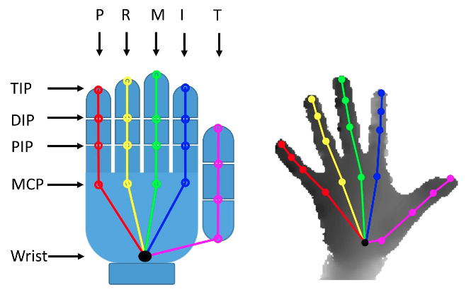

## First-Person Hand Action Benchmark with RGB-D Videos and 3D Hand Pose Annotations
This repository contains instructions on getting the data and code of the work `First-Person Hand Action Benchmark with RGB-D Videos and 3D Hand Pose Annotations` presented at CVPR 2018. For more information on the benchmark please check out [[1]](#refs).

### Downloading the data
Please fill this [form](https://goo.gl/forms/FIsXpYVIUov0j7Wv2) to download the dataset after reading the [terms and conditions](#terms).

### Dataset structure:

The dataset is organized as the following example:

- File `Video_files/Subject_1/put_salt/1/color/color_0015.jpeg`
Consists of frame number 15 of the color stream of the 1st repetition of 
action class "put salt" by subject number 1.

- File `Video_files/Subject_1/put_salt/1/depth/depth_0015.png`
CConsists of frame number 15 of the depth stream of the 1st repetition of 
action class "put salt" by subject number 1.

- File `Hand_pose_annotation_v1_1/Subject_1/put_salt/1/skeleton.txt`
Contains the hand pose (in world coordinates) for the sequence: repetition 
1 of action class "put salt" by subject number 1. 

- File `Object_6D_pose_annotation_v1/Subject_1/put_salt/1/object_pose.txt`
Contains the 6D object pose for the sequence: repetition 
1 of action class "put salt" by subject number 1. 

Comment: Check Figure 3 and 4 of the paper to learn about action categories. We used a slightly different nomenclature for some actions compared to the paper. These are: "dish soap -> liquid soap"; "read paper -> read letter"; "use spray -> use flash". 
Note: Check `Subjects_info` folder for details on number of sequences, frames, etc. for each subject. The following sequences can be ignored (they were not used in the paper): 'Subject_2/close_milk/4', 'Subject_2/put_tea_bag/2' and 'Subject_4/flip_sponge/2'.

### Image data details
* Camera: Intel RealSense SR300.
* Color data: 1920x1080 32bit, jpeg format.
* Depth data: 640x480 16bit, png format.

### Hand pose data:
Format of each line of skeleton.txt:
`t x_1 y_1 z_1 x_2 y_2 z_2 ... x_21 y_21 z_21`

where `t` is the frame number and `x_i y_i z_i` are the world coordinates (in mm) of joint `i` at frame `t`.

Hand joints are organised as follows:
`[Wrist, TMCP, IMCP, MMCP, RMCP, PMCP, TPIP, TDIP, TTIP, IPIP, IDIP, ITIP, MPIP, MDIP, MTIP, RPIP, RDIP, RTIP, PPIP, PDIP, PTIP]`, where ’T’, ’I’, ’M’, ’R’, ’P’ denote ’Thumb’, ’Index’, ’Middle’, ’Ring’, ’Pinky’ fingers.  



Check out the scripts `load_example.x` (.py for Python and .m for Matlab) for examples on how to visualise the hand pose on both color and depth images.

**Updated 20/02/2019**:  We also provide action sequences with normalized hand poses.  Normalization of hand poses is essential to replicate the action recognition results on the paper. It's briefly mentioned on the paper, but if you want to normalize the hand poses you will need to: compute average distance among subjects between joints, normalize the distance between joints to have the same distance on every frame and subject, make the wrist the origin of coordinates for each frame and (optional but helps) align the wrist with one of the axis by rotating the 3D skeleton. 

### Object pose data:
Available objects: 'juice carton', 'milk bottle', 'salt' and 'liquid soap'.
Format of each line of object_pose.txt:

`t M11 M21 M31 M41 M12 ... Mij... M44`

where `Mij` is the element of the transformation matrix `M` at row `i` and column `j`. 

Check the Python code `load_example.py` to see an example on how to visualise the object model for a given pose on top of the image.

### Object models
Available objects: 'juice carton', 'milk bottle', 'salt' and 'liquid soap'.

Format [.PLY](https://en.wikipedia.org/wiki/PLY_(file_format)). Each object comes with a texture file `texture.jpg`. Coordinates are in meters (in contrast to mm for hand poses).

Juice carton and milk bottle objects also appear in this popular [6D object pose estimation dataset](http://rkouskou.gitlab.io/research/LCHF.html) and part of the recent [6D ECCV 2018 benchmark](https://arxiv.org/abs/1808.08319). We recaptured the object models attempting to improve the quality. Feel free to use the older [models](http://rkouskou.gitlab.io/research/LCHF.html), however our object pose data is annotated for the new models.

Comment: The milk bottle model is not exactly the same as the one used when capturing the dataset. The object got lost (campus cleaning services) and when we bought the milk model again the brand had (slightly) changed the bottle design.

### Camera parameters:
#### Depth sensor (intrinsics)
Image center:
* u0 = 315.944855;
* v0 = 245.287079;

Focal Length:
* fx = 475.065948;
* fy = 475.065857;

#### RGB sensor (intrinsics)
Image center:
* u0 = 935.732544;
* v0 = 540.681030;

Focal Length:
* fx = 1395.749023;
* fy = 1395.749268;

#### Extrinsics
R = [0.999988496304, -0.00468848412856, 0.000982563360594;
     0.00469115935266, 0.999985218048, -0.00273845880292;
    -0.000969709653873, 0.00274303671904, 0.99999576807;
     0,0,0];
 
t = [25.7; 1.22; 3.902; 1];

### Benchmark tasks 
In this section we describe the protocols used for the experiments on the paper.
#### Action recognition
data_split_action_recognition.txt contains the 1:1 split reported on the paper. These are the files you should use for training and testing if you want to compare with the results reported.

#### Hand pose estimation
- Cross subject: training subjects are 1, 3, 4. The rest for test.
- Cross object:  test scenario includes all actions with the following objects 'peanut butter', 'fork', 'milk', 'tea', 'liquid soap', 'spray/flash', 'paper' (including reading letter), 'calculator', 'phone', 'coin', 'card' and 'wine bottle'. The rest of objects are for training.

### Terms and conditions
<a name="terms"></a>
The download and use of the dataset is released for academic research only and it is free to researchers from educational or research institutes for non-commercial purposes. When downloading the dataset you agree to (unless with expressed permission of the authors): not redistribute, modificate, or commercial usage of this dataset in any way or form, either partially or entirely.

If using this dataset, please cite the following paper:

```
@inproceedings{FirstPersonAction_CVPR2018,
  title={First-Person Hand Action Benchmark with RGB-D Videos and 3D Hand Pose Annotations},
  author={Garcia-Hernando, Guillermo and Yuan, Shanxin and Baek, Seungryul and Kim, Tae-Kyun}
  booktitle = {Proceedings of Computer Vision and Pattern Recognition ({CVPR})},
  year = {2018}
}
```

### Acknowledgments
This dataset is part of Imperial College London-Samsung Research project, supported by Samsung Electronics.

Authors thank Gabriel Garcia for object model acquisition and [Yana Hasson](https://github.com/hassony2) for providing Python scripts and feedback on the dataset.

### References
<a name="refs"></a>

[1] *First-Person Hand Action Benchmark with RGB-D Videos and 3D Hand Pose Annotations*, Guillermo Garcia-Hernando, Shanxin Yuan, Seungryul Baek and Tae-Kyun Kim, CVPR 2018. [arXiv](https://arxiv.org/abs/1704.02463)
